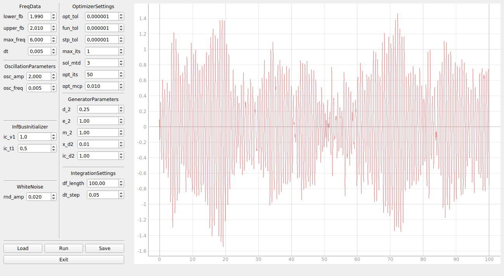

## Now it looks like this:



## How to deploy it:

First of all, you should have ```python 3.x``` and ```git``` in your PATH variable to work with this project.

*Note for Windows users*: If you want to use python to run it, you should start a command line with administrator's privileges. There is also the binary *MAPSetup.exe* in *bin/* directory. You can just clone this repository and run *MAPSetup.exe* ignoring all steps below.

## Deploying this project on your local machine:
First of all, clone the repository:

    git clone https://github.com/greylord1996/MAP.git
    cd MAP/

Create a new virtual environment:

    # on Linux:
    python3 -m venv mapenv
    # on Windows:
    python -m venv mapenv

Activate the environment:

    # on Linux:
    source mapenv/bin/activate
    # on Windows:
    call mapenv\Scripts\activate.bat

Install required dependencies:

    # on Linux:
    pip install --upgrade pip -r requirements.txt
    # on Windows:
    python -m pip install --upgrade pip -r requirements.txt

Finally, run *src/main.py*:

    # on Linux:
    python3 src/main.py
    # on Windows:
    python src\main.py

